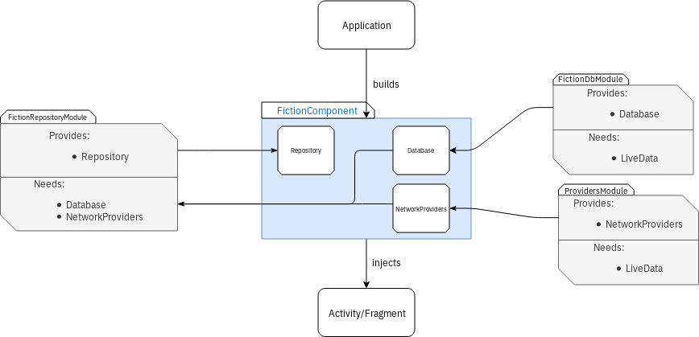

---

---

<h1 id="fusy">Fusy</h1>
<h2 id="a-webserial-library-manager">A webserial library manager</h2>

This project will try to implement custom APIs to <a href="https://www.royalroad.com/">royalroad.com</a>, <a href="http://japtem.com/fanfic.php">japtem</a>, <a href="https://www.fanfiction.net/">fanfiction.net</a>, <a href="https://www.wattpad.com/">wattpad</a> and other webserials and fanfiction websites.

The goal would be to centralise all those sources, add the ability to download the fictions offline and manage them in a library.

<h3 id="fictioncomponent">FictionComponent</h3>

I am using dagger to try my hand at dependency injection. I’ve decided to create a singleton component that will manage the FictionRepository, which itself will manage the FictionDb and the FictionProviders (i.e. RoyalRoad, FanFiction…).

 
<a href="https://www.draw.io/#HCamilleBC%2Ffusy%2Fmaster%2Fdocs%2Fimages%2FFictionDependencies.xml">Edit</a>

Updates:

<ul>
<li><a href="https://github.com/CamilleBC/fusy/commit/76173f3b7ca6f2c4dd43769217421a798013fa5f">2018/12/03</a>:  using <a href="https://bumptech.github.io/glide/">Glide</a> to manage image loadings.</li>
<li><strong>2018/12/05</strong>: add a diagram to explain the FictionComponent architecture.</li>
</ul>
<blockquote>

Written with <a href="https://stackedit.io/">StackEdit</a>.

</blockquote>

